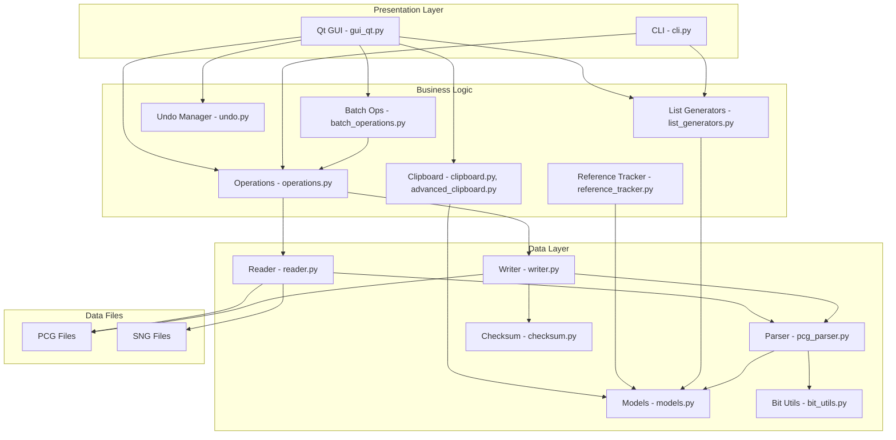

# Design Document: Feature Parity Review

## Overview

This design document outlines the architecture and implementation approach for achieving complete feature parity between the Python PCG Tools and the original C# PCG Tools application, with primary focus on Korg Kronos support.

The Python implementation uses a modular architecture with clear separation between:
- **Data Layer**: Binary parsing, data models, file I/O
- **Business Logic**: Operations, clipboard, batch processing
- **Presentation Layer**: Qt GUI, CLI interface

## Architecture



## Feature Gap Analysis (C# vs Python)

Based on comprehensive deep-dive analysis of the C# codebase (MainWindow.xaml, PcgWindow.xaml, CombiWindow.xaml, SettingsWindow.xaml, ListGeneratorWindow.xaml, Edit dialogs, Tools), here is the complete feature comparison:

---

### 1. FILE OPERATIONS (MainWindow.xaml)

| Feature | C# | Python | Status | Notes |
|---------|----|----|--------|-------|
| Open PCG files | ✅ | ✅ | Complete | Multiple files supported |
| Save PCG files | ✅ | ✅ | Complete | Hardware-tested |
| Save As | ✅ | ✅ | Complete | |
| Revert to Saved | ✅ | ✅ | Complete | |
| Close file | ✅ | ✅ | Complete | Ctrl+F4 |
| Export to Cubase | ✅ | ❌ | **Missing** | Instrument definition files |
| Open SNG files | ✅ | ❌ | **Missing** | Song files |

---

### 2. PCG WINDOW FEATURES (PcgWindow.xaml)

| Feature | C# | Python | Status | Notes |
|---------|----|----|--------|-------|
| Programs radio button | ✅ | ✅ | Complete | |
| Combis radio button | ✅ | ✅ | Complete | |
| Set Lists radio button | ✅ | ✅ | Complete | |
| Wave Sequences radio button | ✅ | ❌ | **Missing** | View wave sequences |
| Drum Kits radio button | ✅ | ❌ | **Missing** | View drum kits |
| Drum Patterns radio button | ✅ | ❌ | **Missing** | View drum patterns |
| All Patches radio button | ✅ | ❌ | **Missing** | View all patch types |
| Number of patches display | ✅ | ✅ | Complete | Status bar |
| Number of selected patches | ✅ | ✅ | Complete | |
| Bank list with Content Type | ✅ | ✅ | Complete | Shows HD-1/EXi |
| Patch list columns | ✅ | ✅ | Complete | ID, Name, Fav, Category |
| Reference column | ✅ | ✅ | Complete | For set list slots |
| Program/Combi Name column | ✅ | ✅ | Complete | Referenced patch name |
| Volume column | ✅ | ✅ | Complete | For set list slots |
| Description column | ✅ | ✅ | Complete | For set list slots |
| Number of References column | ✅ | ❌ | **Missing** | Shows usage count |
| Cut/Copy/Paste buttons | ✅ | ✅ | Complete | |
| Exit Copy/Paste Mode | ✅ | ❌ | **Missing** | Exit clipboard mode |
| Recall Clipboard | ✅ | ❌ | **Missing** | Recall previous clipboard |
| Edit button | ✅ | ✅ | Complete | F2 shortcut |
| Move Up/Down buttons | ✅ | ✅ | Complete | |
| Clear button | ✅ | ✅ | Complete | |
| Compact button | ✅ | ✅ | Complete | |
| Sort button | ✅ | ✅ | Complete | |
| Timbres button | ✅ | ✅ | Complete | |
| Assign button | ✅ | ✅ | Complete | Assign to slot |
| Generate List button | ✅ | ✅ | Complete | |

---

### 3. COMBI WINDOW / TIMBRE FEATURES (CombiWindow.xaml)

| Feature | C# | Python | Status | Notes |
|---------|----|----|--------|-------|
| Timbre # column | ✅ | ✅ | Complete | 1-16 |
| Program ID column | ✅ | ✅ | Complete | |
| Program Name column | ✅ | ✅ | Complete | |
| Category column | ✅ | ✅ | Complete | |
| Sub-Category column | ✅ | ✅ | Complete | |
| Volume column | ✅ | ✅ | Complete | |
| Status column (INT/EXT/OFF) | ✅ | ✅ | Complete | |
| Mute column | ✅ | ✅ | Complete | |
| Priority column | ✅ | ✅ | Complete | |
| MIDI Channel column | ✅ | ✅ | Complete | |
| Key Zone column | ✅ | ✅ | Complete | |
| Velocity Zone column | ✅ | ✅ | Complete | |
| OSC Mode column | ✅ | ✅ | Complete | |
| OSC Select column | ✅ | ✅ | Complete | |
| Transpose column | ✅ | ✅ | Complete | |
| Detune column | ✅ | ✅ | Complete | |
| Portamento column | ✅ | ✅ | Complete | |
| Bend Range column | ✅ | ✅ | Complete | |
| Move Up/Down buttons | ✅ | ✅ | Complete | |
| Clear button | ✅ | ✅ | Complete | |
| Assigned Clear Program | ✅ | ❌ | **Missing** | Custom clear program |

---

### 4. EDIT MENU FEATURES (MainWindow.xaml)

| Feature | C# | Python | Status | Notes |
|---------|----|----|--------|-------|
| Edit (F2) | ✅ | ✅ | Complete | |
| Set Favorite | ✅ | ✅ | Complete | |
| Unset Favorite | ✅ | ✅ | Complete | |
| Clear | ✅ | ✅ | Complete | |
| Clear Duplicates | ✅ | ✅ | Complete | |
| Compact | ✅ | ✅ | Complete | |
| Sort | ✅ | ✅ | Complete | |
| Cut | ✅ | ✅ | Complete | Ctrl+X |
| Copy | ✅ | ✅ | Complete | Ctrl+C |
| Paste | ✅ | ✅ | Complete | Ctrl+V |
| Exit Cut/Copy/Paste Mode | ✅ | ❌ | **Missing** | |
| Recall | ✅ | ❌ | **Missing** | Recall clipboard |
| Move Up | ✅ | ✅ | Complete | NumPad8 |
| Move Down | ✅ | ✅ | Complete | NumPad2 |
| Change Volume | ✅ | ❌ | **Missing** | Batch volume change |
| Init as MPE Combi | ✅ | ❌ | **Missing** | Kronos MPE feature |
| Assign to Set List Slot | ✅ | ✅ | Complete | |
| Auto-Fill Set List Slot Names | ✅ | ✅ | Complete | |
| Capitalize Name | ✅ | ✅ | Complete | |
| Title Case Name | ✅ | ✅ | Complete | |
| Decapitalize Name | ✅ | ✅ | Complete | |

---

### 5. SHOW MENU FEATURES

| Feature | C# | Python | Status | Notes |
|---------|----|----|--------|-------|
| Show Timbres | ✅ | ✅ | Complete | |
| Hex Export | ✅ | ❌ | **Missing** | Debug/analysis feature |
| Show Single-Lined Descriptions | ✅ | ❌ | **Missing** | Display option |
| Special Event | ✅ | ❌ | Not needed | Marketing feature |

---

### 6. TOOLS MENU FEATURES

| Feature | C# | Python | Status | Notes |
|---------|----|----|--------|-------|
| Master Files - Show | ✅ | ❌ | **Missing** | Master file management |
| Master Files - Set as Master | ✅ | ❌ | **Missing** | |
| Generate List | ✅ | ✅ | Partial | See List Generator section |
| Program Reference Changer | ✅ | ❌ | **Missing** | Change program refs in combis/slots |
| Double to Single Keyboard | ✅ | ❌ | **Missing** | Kronos-specific |

---

### 7. SETTINGS WINDOW (SettingsWindow.xaml)

| Tab/Feature | C# | Python | Status | Notes |
|-------------|----|----|--------|-------|
| **PCG Window Tab** |
| Show Number of References Column | ✅ | ❌ | **Missing** | |
| Show Single-Lined Descriptions | ✅ | ❌ | **Missing** | |
| Clear Patches options | ✅ | ⚠️ | Partial | Basic clear only |
| Fix References to Cleared Patches | ✅ | ❌ | **Missing** | |
| **Files Tab** |
| Auto-Backup Enabled | ✅ | ✅ | Complete | |
| Auto-Backup Interval | ✅ | ✅ | Complete | |
| Auto-Backup Max Storage | ✅ | ❌ | **Missing** | |
| Auto-Load Master File | ✅ | ❌ | **Missing** | |
| Default Output Directory | ✅ | ❌ | **Missing** | |
| Sequencer Files Directory | ✅ | ❌ | **Missing** | |
| Manual Path | ✅ | ❌ | **Missing** | |
| **Edit Tab** |
| Rename File When Patch Name Changes | ✅ | ❌ | **Missing** | |
| **Cut/Copy/Paste Tab** |
| Copy Incomplete Set List Slots | ✅ | ❌ | **Missing** | |
| Copy Incomplete Combis | ✅ | ❌ | **Missing** | |
| Copy Patches from Master File | ✅ | ❌ | **Missing** | |
| Paste Duplicate Programs | ✅ | ❌ | **Missing** | |
| Paste Duplicate Combis | ✅ | ❌ | **Missing** | |
| Paste Duplicate Set List Slots | ✅ | ❌ | **Missing** | |
| Paste Duplicate Drum Kits | ✅ | ❌ | **Missing** | |
| Paste Duplicate Drum Patterns | ✅ | ❌ | **Missing** | |
| Paste Duplicate Wave Sequences | ✅ | ❌ | **Missing** | |
| Auto-Extend Paste | ✅ | ❌ | **Missing** | |
| Patch Name Duplication Checking | ✅ | ❌ | **Missing** | |
| Overwrite Filled Programs | ✅ | ❌ | **Missing** | |
| Overwrite Filled Combis | ✅ | ❌ | **Missing** | |
| Overwrite Filled Set List Slots | ✅ | ❌ | **Missing** | |
| **Sort Tab** |
| Split Character | ✅ | ❌ | **Missing** | For title/artist sorting |
| Title/Artist Order | ✅ | ❌ | **Missing** | |
| Sort Order Options | ✅ | ⚠️ | Partial | Basic sort only |
| **Categories Tab** |
| Category Set A/B | ✅ | ❌ | **Missing** | |

---

### 8. LIST GENERATOR (ListGeneratorWindow.xaml)

| Feature | C# | Python | Status | Notes |
|---------|----|----|--------|-------|
| **List Types** |
| Patch List | ✅ | ✅ | Complete | |
| Program Usage List | ✅ | ✅ | Complete | |
| Combi Content List | ✅ | ✅ | Complete | Short and Long |
| Differences List | ✅ | ✅ | Complete | |
| File Content List | ✅ | ❌ | **Missing** | Bank usage summary |
| **Differences List Options** |
| Max Number of Differences | ✅ | ❌ | **Missing** | |
| Ignore Patch Names | ✅ | ❌ | **Missing** | |
| Ignore Set List Slot Descriptions | ✅ | ❌ | **Missing** | |
| Search Both Directions | ✅ | ❌ | **Missing** | |
| **Filter Program Banks** |
| Individual bank checkboxes | ✅ | ❌ | **Missing** | I-A through U-GG |
| GM bank checkbox | ✅ | ❌ | **Missing** | |
| Virtual Banks checkbox | ✅ | ❌ | **Missing** | |
| Ignore Empty/Init Programs | ✅ | ⚠️ | Partial | |
| Ignore First Program | ✅ | ❌ | **Missing** | |
| Select All / Deselect All | ✅ | ❌ | **Missing** | |
| **Filter Combi Banks** |
| Individual bank checkboxes | ✅ | ❌ | **Missing** | |
| Virtual Banks checkbox | ✅ | ❌ | **Missing** | |
| Ignore Empty/Init Combis | ✅ | ⚠️ | Partial | |
| Ignore Muted/Off Timbres | ✅ | ❌ | **Missing** | |
| Ignore Muted/Off First Program Timbre | ✅ | ❌ | **Missing** | |
| **Filter Set Lists** |
| Enabled checkbox | ✅ | ❌ | **Missing** | |
| Range (From/To) | ✅ | ❌ | **Missing** | |
| Ignore Empty/Init Set List Slots | ✅ | ⚠️ | Partial | |
| **Filter Wave Sequences** |
| Enabled checkbox | ✅ | ❌ | **Missing** | |
| Ignore Empty/Init | ✅ | ❌ | **Missing** | |
| **Filter Drum Kits** |
| Enabled checkbox | ✅ | ❌ | **Missing** | |
| Ignore Empty/Init | ✅ | ❌ | **Missing** | |
| **Filter Drum Patterns** |
| Enabled checkbox | ✅ | ❌ | **Missing** | |
| Ignore Empty/Init | ✅ | ❌ | **Missing** | |
| **Filter on Favorites** |
| Three-state checkbox | ✅ | ⚠️ | Partial | |
| **Filter on Text** |
| Filter enabled checkbox | ✅ | ✅ | Complete | |
| Text to filter on | ✅ | ✅ | Complete | |
| Case sensitive | ✅ | ❌ | **Missing** | |
| Filter Program Names | ✅ | ✅ | Complete | |
| Filter Combi Names | ✅ | ✅ | Complete | |
| Filter Set List Slot Names | ✅ | ✅ | Complete | |
| Filter Set List Slot Descriptions | ✅ | ❌ | **Missing** | |
| Filter Wave Sequence Names | ✅ | ❌ | **Missing** | |
| Filter Drum Kit Names | ✅ | ❌ | **Missing** | |
| Filter Drum Pattern Names | ✅ | ❌ | **Missing** | |
| **Optional Columns** |
| CRC Value Excluding Name | ✅ | ❌ | **Missing** | |
| CRC Value Including Name | ✅ | ❌ | **Missing** | |
| Set List Slot Reference ID | ✅ | ✅ | Complete | |
| Set List Slot Reference Name | ✅ | ✅ | Complete | |
| **Sorting** |
| Type/Bank/Index | ✅ | ✅ | Complete | |
| Category then Patch Name | ✅ | ✅ | Complete | |
| Patch Name | ✅ | ✅ | Complete | |
| **Output Formats** |
| ASCII Table | ✅ | ❌ | **Missing** | |
| Text | ✅ | ✅ | Complete | |
| CSV | ✅ | ✅ | Complete | |
| XML | ✅ | ❌ | **Missing** | |
| Output File selection | ✅ | ✅ | Complete | |

---

### 9. EDIT DIALOGS (Edit folder)

| Dialog | C# | Python | Status | Notes |
|--------|----|----|--------|-------|
| Edit Single Program | ✅ | ✅ | Complete | Name, category, favorite |
| Edit Single Combi | ✅ | ✅ | Complete | Name, category, favorite, tempo |
| Edit Single Set List | ✅ | ✅ | Complete | Name |
| Edit Single Set List Slot | ✅ | ✅ | Complete | All 16 colors, text sizes |
| Edit Multiple Combis | ✅ | ❌ | **Missing** | Batch combi editing |
| Edit Multiple Combi Banks | ✅ | ❌ | **Missing** | Batch bank editing |
| Edit Multiple Set List Slots | ✅ | ❌ | **Missing** | Batch slot editing |
| Edit Parameter (generic) | ✅ | ❌ | **Missing** | Generic parameter editor |

---

### 10. SONG WINDOW (SongWindow.xaml)

| Feature | C# | Python | Status | Notes |
|---------|----|----|--------|-------|
| Songs tab | ✅ | ❌ | **Missing** | List songs |
| Song Index column | ✅ | ❌ | **Missing** | |
| Song Name column | ✅ | ❌ | **Missing** | |
| MIDI Tracks button | ✅ | ❌ | **Missing** | View MIDI tracks |
| Export to File button | ✅ | ❌ | **Missing** | Export song data |
| Samples tab | ✅ | ❌ | **Missing** | List samples |
| Sample Index column | ✅ | ❌ | **Missing** | |
| Sample Name column | ✅ | ❌ | **Missing** | |
| Sample File Name column | ✅ | ❌ | **Missing** | |
| Export Samples to File | ✅ | ❌ | **Missing** | |

---

### 11. PROGRAM REFERENCE CHANGER (ProgramReferenceChangerWindow.xaml)

| Feature | C# | Python | Status | Notes |
|---------|----|----|--------|-------|
| Reference Rules text box | ✅ | ❌ | **Missing** | Enter rules |
| From File button | ✅ | ❌ | **Missing** | Load rules from file |
| Progress bar | ✅ | ❌ | **Missing** | Show progress |
| OK/Cancel buttons | ✅ | ❌ | **Missing** | |

---

### 12. STATUS BAR (MainWindow.xaml)

| Feature | C# | Python | Status | Notes |
|---------|----|----|--------|-------|
| Model name display | ✅ | ✅ | Complete | Shows "Kronos" etc. |
| File type display | ✅ | ✅ | Complete | Shows "PCG" etc. |
| Songs count | ✅ | ❌ | **Missing** | For SNG files |
| Samples count | ✅ | ❌ | **Missing** | For SNG files |
| Programs count | ✅ | ✅ | Complete | |
| Combis count | ✅ | ✅ | Complete | |
| Set Lists count | ✅ | ✅ | Complete | |
| Drum Kits count | ✅ | ❌ | **Missing** | |
| Drum Patterns count | ✅ | ❌ | **Missing** | |
| Wave Sequences count | ✅ | ❌ | **Missing** | |
| Clipboard status | ✅ | ⚠️ | Partial | Basic status only |

---

### 13. HELP MENU (MainWindow.xaml)

| Feature | C# | Python | Status | Notes |
|---------|----|----|--------|-------|
| About dialog | ✅ | ✅ | Complete | |
| Home page link | ✅ | ❌ | **Missing** | Open website |
| Manual link | ✅ | ❌ | **Missing** | Open manual |
| External links (Korg) | ✅ | ❌ | **Missing** | Korg-related links |
| External links (Contributors) | ✅ | ❌ | **Missing** | |
| External links (Video creators) | ✅ | ❌ | **Missing** | |
| External links (Donators) | ✅ | ❌ | **Missing** | |
| External links (Translators) | ✅ | ❌ | **Missing** | |
| External links (Third parties) | ✅ | ❌ | **Missing** | |

---

### 14. WINDOWS MENU (MainWindow.xaml)

| Feature | C# | Python | Status | Notes |
|---------|----|----|--------|-------|
| Go to Next Window (F6) | ✅ | ❌ | **Missing** | MDI navigation |
| Go to Previous Window (Ctrl+F6) | ✅ | ❌ | **Missing** | MDI navigation |

---

### 15. PATCH SORTING (Model/Common/Synth/PatchSorting/)

| Feature | C# | Python | Status | Notes |
|---------|----|----|--------|-------|
| Name comparer | ✅ | ✅ | Complete | |
| Category comparer | ✅ | ✅ | Complete | |
| Title comparer | ✅ | ❌ | **Missing** | For title/artist sorting |
| Artist comparer | ✅ | ❌ | **Missing** | For title/artist sorting |
| Empty/Init comparer | ✅ | ✅ | Complete | |
| Composite comparer | ✅ | ⚠️ | Partial | Basic only |

---

### PRIORITY CLASSIFICATION

**HIGH PRIORITY (Core Kronos Features)**
1. Program Reference Changer - Change program refs in combis/set lists
2. Master Files support - For files without global chunk
3. File Content List - Bank usage summary
4. Number of References column - Show usage count
5. Batch Volume Change - Change volume for multiple combis
6. CRC Values - For patch comparison
7. Wave Sequences/Drum Kits/Drum Patterns view
8. Status bar counts for drum kits/patterns/wave sequences

**MEDIUM PRIORITY (Nice to Have)**
1. Cubase Export - Instrument definition files
2. Hex Export - Debug/analysis feature
3. ASCII Table output - Formatted text tables
4. XML output - Structured export
5. Virtual Banks - Aggregated views
6. Edit Multiple dialogs - Batch editing
7. Advanced Settings - Copy/paste options
8. SNG File Support - Song files
9. Title/Artist sorting comparers
10. Window navigation (F6, Ctrl+F6)

**LOW PRIORITY (Rarely Used)**
1. Init as MPE Combi - Kronos MPE feature
2. Double to Single Keyboard - Kronos-specific
3. Theme selection - UI customization
4. Multi-language support - 14 languages
5. Recall Clipboard - Clipboard history
6. Exit Copy/Paste Mode - Mode management
7. Help menu external links
8. Manual path configuration

## Components and Interfaces

### 1. PCG Parser (`pcg_parser.py`)

**Purpose**: Low-level binary parsing of PCG file chunks.

**Key Interfaces**:
```python
class PcgParser:
    def parse_file(self, filepath: str) -> PcgFile
    def parse_chunk(self, data: bytes, offset: int) -> Chunk
    def parse_program(self, data: bytes, model: KorgModel) -> Program
    def parse_combi(self, data: bytes, model: KorgModel) -> Combi
    def parse_setlist(self, data: bytes, model: KorgModel) -> SetList
```

**Kronos-Specific Chunks**:
- `PCG1` - File header
- `PRG1` - Program bank
- `CMB1` - Combi bank
- `SLS1` - Set list
- `GLB1` - Global settings
- `DKT1` - Drum kits
- `WVS1` - Wave sequences

### 2. Data Models (`models.py`)

**Purpose**: In-memory representation of PCG data structures.

**Key Classes**:
```python
@dataclass
class PcgFile:
    header: PcgHeader
    program_banks: List[Bank]
    combi_banks: List[Bank]
    set_lists: List[SetList]
    has_global: bool
    raw_chunks: Dict[str, bytes]

@dataclass
class Program:
    id: str
    name: str
    bank: str
    index: int
    category: Category
    sub_category: SubCategory
    favorite: bool
    osc_mode: int
    raw_data: bytes

@dataclass
class Combi:
    id: str
    name: str
    bank: str
    index: int
    category: Category
    sub_category: SubCategory
    favorite: bool
    tempo: float
    timbres: List[Timbre]
    raw_data: bytes

@dataclass
class Timbre:
    program_bank: str
    program_index: int
    volume: int
    midi_channel: int
    transpose: int
    detune: int
    status: TimbreStatus
    mute: bool
    key_zone_bottom: int
    key_zone_top: int
    vel_zone_bottom: int
    vel_zone_top: int
    priority: int
    portamento: int

@dataclass
class SetListSlot:
    name: str
    color: int
    text_size: TextSize
    transpose: int
    volume: int
    description: str
    reference_type: ReferenceType
    reference_bank: str
    reference_index: int
```

### 3. Writer (`writer.py`)

**Purpose**: Serialize PCG data back to binary format with correct checksums.

**Key Interfaces**:
```python
class PcgWriter:
    def write_file(self, pcg: PcgFile, filepath: str) -> None
    def serialize_program(self, program: Program) -> bytes
    def serialize_combi(self, combi: Combi) -> bytes
    def serialize_setlist(self, setlist: SetList) -> bytes
    def calculate_checksum(self, data: bytes) -> int
```

### 4. Operations (`operations.py`)

**Purpose**: High-level patch management operations.

**Key Functions**:
```python
def move_patch_up(bank: Bank, index: int) -> bool
def move_patch_down(bank: Bank, index: int) -> bool
def clear_patch(patch: Patch) -> None
def compact_bank(bank: Bank) -> int  # Returns number moved
def sort_bank(bank: Bank, key: SortKey) -> None
def remove_duplicates(bank: Bank, update_refs: bool) -> int
def capitalize_names(patches: List[Patch]) -> int
```

### 5. Clipboard (`clipboard.py`, `advanced_clipboard.py`)

**Purpose**: Copy/paste operations with reference tracking.

**Key Interfaces**:
```python
class PcgClipboard:
    def copy_programs(self, programs: List[Program]) -> None
    def copy_combis(self, combis: List[Combi], include_programs: bool) -> None
    def copy_slots(self, slots: List[SetListSlot], include_patches: bool) -> None
    def paste_programs(self, dest_bank: Bank, start_index: int) -> PasteResult
    def paste_combis(self, dest_bank: Bank, start_index: int, remap: bool) -> PasteResult
    def validate_engine_compatibility(self, source: Program, dest_bank: Bank) -> bool
```

### 6. Reference Tracker (`reference_tracker.py`)

**Purpose**: Track and update program references in combis and set lists.

**Key Interfaces**:
```python
class ReferenceTracker:
    def get_program_usage(self, program: Program) -> List[Reference]
    def get_reference_count(self, program: Program) -> int
    def update_references(self, old_ref: ProgramRef, new_ref: ProgramRef) -> int
    def validate_references(self, pcg: PcgFile) -> List[InvalidReference]
```

### 7. List Generators (`list_generators.py`)

**Purpose**: Generate reports and export files.

**Key Interfaces**:
```python
class ListGenerator:
    def generate_patch_list(self, output: str, format: ExportFormat) -> None
    def generate_program_usage(self, output: str, format: ExportFormat) -> None
    def generate_combi_content(self, output: str, format: ExportFormat, style: str) -> None
    def generate_differences(self, other: PcgFile, output: str, format: ExportFormat) -> None
    def generate_file_content(self, output: str, format: ExportFormat) -> None
```

## Data Models

### Kronos Program Structure (HD-1)

| Offset | Size | Field | Description |
|--------|------|-------|-------------|
| 0x00 | 24 | name | Program name (ASCII) |
| 0x18 | 1 | category | Category (0-15) |
| 0x19 | 1 | sub_category | Sub-category |
| 0x1A | 1 | favorite | Favorite flag |
| 0x1B | 1 | osc_mode | Oscillator mode |
| ... | ... | ... | Additional parameters |

### Kronos Combi Structure

| Offset | Size | Field | Description |
|--------|------|-------|-------------|
| 0x00 | 24 | name | Combi name (ASCII) |
| 0x18 | 1 | category | Category (0-15) |
| 0x19 | 1 | sub_category | Sub-category |
| 0x1A | 1 | favorite | Favorite flag |
| 0x1C | 2 | tempo | Tempo (BPM * 10) |
| 0x20 | 16*N | timbres | 16 timbre structures |

### Kronos Set List Slot Structure

| Offset | Size | Field | Description |
|--------|------|-------|-------------|
| 0x00 | 24 | name | Slot name (ASCII) |
| 0x18 | 1 | color | Color (0-16) |
| 0x19 | 1 | text_size | Font size (0-4: XS/S/M/L/XL) |
| 0x1A | 1 | transpose | Transpose (-24 to +24) |
| 0x1B | 1 | volume | Volume (0-127) |
| 0x1C | 1 | ref_type | Reference type (0=Program, 1=Combi) |
| 0x1D | 1 | ref_bank | Reference bank index |
| 0x1E | 2 | ref_index | Reference slot index |
| 0x20 | 512 | description | Description text |

## Correctness Properties

*A property is a characteristic or behavior that should hold true across all valid executions of a system-essentially, a formal statement about what the system should do. Properties serve as the bridge between human-readable specifications and machine-verifiable correctness guarantees.*

### Property 1: PCG File Round-Trip Integrity
*For any* valid Kronos PCG file, reading the file and writing it back without modifications SHALL produce a byte-for-byte identical file.
**Validates: Requirements 1.1, 1.2, 1.3, 1.4, 1.5, 1.6, 1.7**

### Property 2: Program Name Round-Trip
*For any* valid 24-character ASCII string, setting a program's name to that string and reading it back SHALL return the identical string.
**Validates: Requirements 2.1**

### Property 3: Program Category Round-Trip
*For any* category value in the range 0-15, setting a program's category and reading it back SHALL return the identical value.
**Validates: Requirements 2.2**

### Property 4: Program Favorite Round-Trip
*For any* boolean value, setting a program's favorite flag and reading it back SHALL return the identical value.
**Validates: Requirements 2.4**

### Property 5: GM2 Bank Read-Only Protection
*For any* program in a GM2 bank (g(1)-g(9), g(d)), attempting to modify the program SHALL fail without changing the program data.
**Validates: Requirements 2.8**

### Property 6: Copy/Paste Program Integrity
*For any* program, copying it and pasting to an empty slot SHALL produce a program with identical data (excluding location-specific fields).
**Validates: Requirements 4.1, 4.2**

### Property 7: Copy/Paste Combi Integrity
*For any* combi, copying it and pasting to an empty slot SHALL produce a combi with identical data and valid timbre references.
**Validates: Requirements 4.3, 4.4**

### Property 8: Engine Type Validation
*For any* HD-1 program and any EXi bank, attempting to paste the program into the bank SHALL fail. The same applies for EXi programs into HD-1 banks.
**Validates: Requirements 4.9, 4.10**

### Property 9: Move Operation Position Invariant
*For any* bank with at least 2 patches, moving a patch up and then down (or vice versa) SHALL return the bank to its original state.
**Validates: Requirements 5.1, 5.2**

### Property 10: Compact Operation Ordering
*For any* bank after compacting, all non-empty patches SHALL be contiguous starting from index 0, and all empty patches SHALL be at the end.
**Validates: Requirements 5.3**

### Property 11: Sort Operation Ordering
*For any* bank after alphabetical sorting, patches SHALL be ordered by name (case-insensitive), with empty/init patches at the end.
**Validates: Requirements 5.4**

### Property 12: Reference Validity After Batch Operations
*For any* batch operation (move, compact, sort, remove duplicates), all combi timbre references and set list slot references SHALL point to valid programs after the operation.
**Validates: Requirements 5.9**

### Property 13: Set List Slot Parameter Round-Trip
*For any* valid set list slot parameter values (color 0-16, text size 0-4, transpose -24 to +24, volume 0-127), setting and reading back SHALL return identical values.
**Validates: Requirements 6.2, 6.3, 6.4, 6.5, 6.6**

### Property 14: Timbre Parameter Round-Trip
*For any* valid timbre parameter values, setting and reading back SHALL return identical values.
**Validates: Requirements 7.2, 7.3, 7.4, 7.5, 7.6, 7.7, 7.8, 7.9, 7.10, 7.11**

### Property 15: Timbre Sort Ordering
*For any* combi after sorting timbres by MIDI channel, timbres SHALL be ordered by channel number with muted/OFF timbres at the end.
**Validates: Requirements 7.14**

## Error Handling

### File Operations
- Invalid file format: Display clear error message with file type detected
- Corrupted chunks: Skip corrupted chunk, warn user, continue loading
- Checksum mismatch: Warn user, offer to continue or abort
- Write failure: Preserve original file, report error

### Edit Operations
- Engine type mismatch: Block operation, display specific error
- Bank full: Offer to find empty slots in other banks
- Invalid parameter value: Clamp to valid range, warn user
- Reference to missing program: Display warning, allow operation

### Clipboard Operations
- Incompatible model: Block paste, display model mismatch error
- Missing destination bank: Offer to create bank
- Insufficient space: Report how many patches can be pasted

## Testing Strategy

### Dual Testing Approach

The testing strategy combines unit tests for specific examples and property-based tests for universal properties.

### Unit Testing
- Test specific file loading scenarios (OS 1.0, 1.5, 2.x, 3.x)
- Test edge cases (empty banks, full banks, corrupted data)
- Test error handling paths
- Test UI state management

### Property-Based Testing

**Library**: `hypothesis` (Python property-based testing library)

**Configuration**: Minimum 100 iterations per property test

**Test Annotations**: Each property test SHALL be tagged with:
```python
# **Feature: feature-parity-review, Property {N}: {property_text}**
# **Validates: Requirements X.Y**
```

**Key Property Tests**:

1. **File Round-Trip Test**
   - Generate random valid PCG structures
   - Write to bytes, read back, compare

2. **Parameter Round-Trip Tests**
   - Generate random valid parameter values
   - Set, read back, verify equality

3. **Operation Invariant Tests**
   - Generate random bank states
   - Apply operation, verify invariants hold

4. **Reference Validity Tests**
   - Generate random operations
   - Verify all references remain valid

### Test File Strategy
- Use real Kronos PCG files for integration tests
- Generate synthetic test data for property tests
- Maintain test fixtures for regression testing
