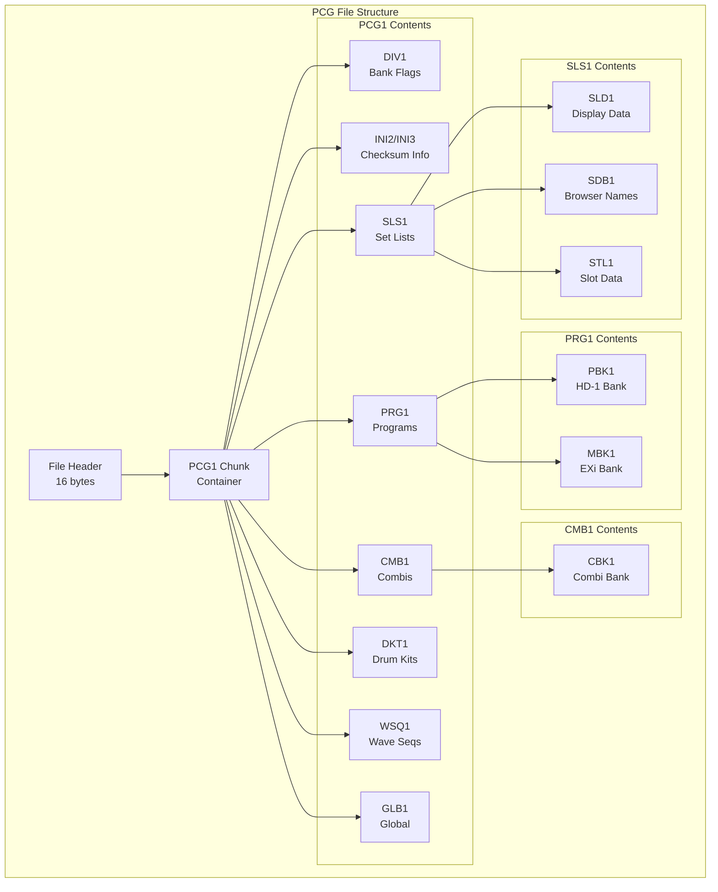

# Design Document: PCG File Structure Deep Dive

## Overview

This design document provides a comprehensive technical reference for the Korg PCG binary file format, with primary focus on Kronos. It documents the exact byte offsets, bit fields, and data structures used in PCG files, serving as the authoritative reference for the Python PCG Tools implementation.

The design is based on analysis of:
- Original C# PCG Tools source code (952 files)
- Official Korg documentation (PCG Structure Kronos.txt, etc.)
- Real PCG file analysis and hardware testing

## Architecture



## Components and Interfaces

### 1. File Header (16 bytes)

| Offset | Size | Field | Description |
|--------|------|-------|-------------|
| 0x00 | 4 | magic | "KORG" ASCII |
| 0x04 | 1 | product_id | Model identifier (see table below) |
| 0x05 | 1 | file_type | 0x00=PCG, 0x01=SNG |
| 0x06 | 1 | major_version | Major version number |
| 0x07 | 1 | minor_version | Minor version number |
| 0x08 | 1 | checksum_flag | 0x00=none, 0x01=checksum |
| 0x09 | 7 | reserved | Reserved bytes |

**Product ID Values:**
| ID | Model |
|----|-------|
| 0x3B | Trinity |
| 0x50 | Triton (sub-ID at 0x08: 0x00=Classic, 0x01=Extreme) |
| 0x5D | Karma |
| 0x63 | Triton LE |
| 0x68 | Kronos |
| 0x70 | Oasys |
| 0x75 | M3 |
| 0x85 | M50 |
| 0x8D | microSTATION |
| 0x95 | Krome |
| 0x96 | Kross |
| 0xC9 | Kross 2 |
| 0xD2 | Krome EX |

### 2. Chunk Structure

All chunks follow this format:

| Offset | Size | Field | Description |
|--------|------|-------|-------------|
| +0 | 4 | chunk_id | 4-character ASCII identifier |
| +4 | 4 | chunk_size | Size of data (big-endian) |
| +8 | N | data | Chunk data |
| +8+N | 0-4 | padding | Alignment to 4-byte boundary |

**Gap Between Chunks:**
- Standard gap: 4 bytes after chunk data
- Some chunks have 8 or 12 byte gaps (model-specific)

### 3. DIV1 Chunk (Bank Presence Flags)

| Offset | Size | Field | Description |
|--------|------|-------|-------------|
| +8 | 2 | prog_banks_1 | Bits: U-CC,U-BB,U-AA,U-G,U-F,U-E,U-D,U-C / U-B,U-A,I-F,I-E,I-D,I-C,I-B,I-A |
| +10 | 2 | reserved1 | Reserved |
| +12 | 2 | prog_banks_2 | Bits: U-GG,U-FF,U-EE,U-DD (extended banks) |
| +14 | 2 | prog_count | Number of program banks |
| +16 | 2 | combi_banks | Bits: U-G,U-F,U-E,U-D,U-C,U-B / U-A,I-G,I-F,I-E,I-D,I-C,I-B,I-A |
| +18 | 2 | reserved2 | Reserved |
| +20 | 2 | combi_count | Number of combi banks |
| +24 | 2 | drumkit_banks | Drum kit bank presence |
| +28 | 2 | drumkit_count | Number of drum kit banks |
| +32 | 2 | waveseq_banks | Wave sequence bank presence |
| +36 | 2 | waveseq_count | Number of wave sequence banks |
| +40 | 1 | has_dpi | 0x01 if drum patterns present |
| +41 | 1 | has_setlists | 0x01 if set lists present |
| +42 | 1 | reserved3 | Reserved |
| +43 | 1 | has_global | 0x01 if global present |

### 4. Program Bank Chunks (PBK1/MBK1)

**PBK1 (HD-1 Programs):**
| Offset | Size | Field | Description |
|--------|------|-------|-------------|
| +0 | 4 | chunk_id | "PBK1" |
| +4 | 4 | chunk_size | Total chunk size |
| +8 | 4 | header | Header data |
| +12 | 4 | num_programs | Number of programs (typically 128) |
| +16 | 4 | program_size | Size of each program in bytes |
| +20 | 4 | bank_id | Bank identifier (see mapping) |
| +24 | N | programs | Program data array |

**MBK1 (EXi Programs):**
Same structure as PBK1, but for modeled synthesis programs.

**Bank ID Mapping (Chunk Headers):**
| Bank ID | Bank Name |
|---------|-----------|
| 0x00000 | I-A |
| 0x00001 | I-B |
| 0x00002 | I-C |
| 0x00003 | I-D |
| 0x00004 | I-E |
| 0x08000 | I-F |
| 0x20000 | U-A |
| 0x20001 | U-B |
| 0x20002 | U-C |
| 0x20003 | U-D |
| 0x20004 | U-E |
| 0x20005 | U-F |
| 0x20006 | U-G |
| 0x20007 | U-AA |
| 0x20008 | U-BB |
| 0x20009 | U-CC |
| 0x2000A | U-DD |
| 0x2000B | U-EE |
| 0x2000C | U-FF |
| 0x2000D | U-GG |

### 5. Kronos Program Data Structure

**HD-1 Program (typical size: ~4200 bytes):**
| Offset | Size | Field | Description |
|--------|------|-------|-------------|
| 0x0000 | 24 | name | Program name (ASCII, null-padded) |
| 0x0058 | 1 | engine_hint | Engine type indicator |
| 0x09FE | 2 | osc_mode_flags | Bits 0-2: OSC mode, Bit 5: Favorite |
| 0x0A08 | 1 | category_byte | Bits 0-4: Category, Bits 5-7: Sub-category |

**OSC Mode Values:**
| Value | Mode |
|-------|------|
| 0 | Single |
| 1 | Double |
| 2 | Drums |
| 3 | - (EXi) |
| 4 | - (Unused) |
| 5 | Double Drums |

### 6. Combi Bank Chunk (CBK1)

| Offset | Size | Field | Description |
|--------|------|-------|-------------|
| +0 | 4 | chunk_id | "CBK1" |
| +4 | 4 | chunk_size | Total chunk size |
| +8 | 4 | header | Header data |
| +12 | 4 | num_combis | Number of combis (typically 128) |
| +16 | 4 | combi_size | Size of each combi (Kronos: 7810 bytes) |
| +20 | 4 | bank_id | Bank identifier |
| +24 | N | combis | Combi data array |

### 7. Kronos Combi Data Structure (7810 bytes)

| Offset | Size | Field | Description |
|--------|------|-------|-------------|
| 0x0000 | 24 | name | Combi name (ASCII, null-padded) |
| 0x0518 | 2 | tempo | Tempo × 100 (little-endian, e.g., 12000 = 120.00 BPM) |
| 0x12B6 | 1 | category_byte | Bits 0-4: Category, Bits 5-7: Sub-category |
| 0x12B7 | 1 | favorite_byte | Bit 0: Favorite flag |
| 0x12C2 | 3008 | timbres | 16 timbres × 188 bytes each |

**Timbre Offset Calculation:**
```
timbre_offset = combi_offset + 0x12C2 + (timbre_index × 188)
```

### 8. Kronos Timbre Data Structure (188 bytes)

| Offset | Size | Field | Bits | Description |
|--------|------|-------|------|-------------|
| +0 | 1 | program_index | 7:0 | Program number (0-127) |
| +1 | 1 | program_bank | 7:0 | Bank PcgId (see mapping) |
| +2 | 1 | status_channel | 7:5=Status, 4:0=MIDI Ch | Status: 0=Off,1=Int,2=Both,3=Ext,4=Ex2 |
| +5 | 1 | volume | 7:0 | Volume (0-127) |
| +6 | 1 | bend_range | 6:0 | Bend range (signed) |
| +7 | 1 | transpose | 7:0 | Transpose (signed, -24 to +24) |
| +8 | 2 | detune | 15:0 | Detune (signed, little-endian) |
| +34 | 1 | mute_flags | 7=Mute | Mute flag |
| +35 | 1 | osc_flags | 4=Priority, 3:2=OscSelect, 1:0=OscMode | Multiple flags |
| +36 | 1 | portamento | 7:0 | Portamento (signed) |
| +37 | 1 | top_key | 7:0 | Top key (0-127) |
| +38 | 1 | bottom_key | 7:0 | Bottom key (0-127) |
| +40 | 1 | top_velocity | 7:0 | Top velocity (1-127) |
| +41 | 1 | bottom_velocity | 7:0 | Bottom velocity (1-127) |

**Timbre Bank PcgId Mapping:**
| PcgId | Bank |
|-------|------|
| 0-5 | I-A through I-F |
| 6 | GM |
| 17-23 | U-A through U-G |
| 24-30 | U-AA through U-GG |

**OSC Mode Values (Timbre):**
| Value | Mode |
|-------|------|
| 0 | Prg (use program setting) |
| 1 | Poly |
| 2 | Mono |
| 3 | Legato |

**OSC Select Values:**
| Value | Selection |
|-------|-----------|
| 0 | Both |
| 1 | Osc1 |
| 2 | Osc2 |

### 9. Set List Structure (SLS1)

The SLS1 chunk contains multiple sub-chunks:

```
SLS1
├── SLD1 (Set List Display - combi-like slot data)
│   └── SDB1 (Browser names for Kronos disk mode)
└── STL1 (Set List data)
    └── SBK1 (Set List Bank - actual slot parameters)
```

**STL1/SBK1 Structure:**
| Offset | Size | Field | Description |
|--------|------|-------|-------------|
| +0 | 4 | chunk_id | "SBK1" |
| +4 | 4 | chunk_size | Total chunk size |
| +8 | 4 | reserved | Reserved |
| +12 | 4 | num_setlists | Number of set lists (128) |
| +16 | 4 | total_size | Total size of all slot data |
| +20 | 4 | reserved2 | Reserved |
| +24 | N | setlists | Set list data |

**Set List Entry:**
| Offset | Size | Field | Description |
|--------|------|-------|-------------|
| +0 | 24 | name | Set list name |
| +24 | M | slots | 128 slots × slot_size |
| +24+M | 16 | padding | Padding between set lists |

### 10. Kronos Set List Slot Data Structure

**Slot Size:** Calculated as `total_size / num_setlists / 128`

| Offset | Size | Field | Bits | Description |
|--------|------|-------|------|-------------|
| +0 | 24 | name | - | Slot name (ASCII, null-padded) |
| +24 | 1 | type_color | 7:6=TextSize LSB, 1:0=PatchType | Combined field |
| +25 | 1 | bank_transpose | 7:5=Transpose MSB, 4:0=BankId | Combined field |
| +26 | 1 | patch_index | 7:0 | Patch index (0-127) |
| +27 | 1 | reserved | - | Reserved |
| +28 | 1 | volume | 7:0 | Volume (0-127) |
| +29 | 1 | transpose_text | 7:5=Transpose LSB, 4=TextSize MSB | Combined field |
| +30 | 512 | description | - | Description text (ASCII) |

**Patch Type Values:**
| Value | Type |
|-------|------|
| 0 | Program |
| 1 | Combi |
| 2 | Song |

**Text Size Calculation:**
```python
text_size = ((byte_29 >> 4) & 0x01) << 2 | ((byte_24 >> 6) & 0x03)
# Values: 0=S, 1=XS, 2=M, 3=L, 4=XL
```

**Transpose Calculation:**
```python
unsigned = ((byte_25 >> 5) & 0x07) << 3 | ((byte_29 >> 5) & 0x07)
# Convert 6-bit unsigned to signed (-24 to +24)
transpose = unsigned if unsigned < 32 else unsigned - 64
```

**Slot Bank ID Mapping:**
| BankId | Bank |
|--------|------|
| 0-7 | I-A through I-H |
| 23-29 | U-A through U-G |
| 30-36 | U-AA through U-GG |

**Color Values:**
| Value | Color |
|-------|-------|
| 0 | Default |
| 136-137 | Brick |
| 140 | Burgundy |
| 144 | Ivy |
| 148 | Olive |
| 152-153 | Gold |
| 156-157 | Cacao |
| 160 | Indigo |
| 164-165 | Navy |
| 168 | Rose |
| 172-174 | Lavender |
| 176 | Azure |
| 180-181 | Denim |
| 184 | Silver |
| 188 | Slate |
| 196 | Charcoal |

### 11. SDB1 Browser Names

The SDB1 chunk stores names displayed in Kronos disk mode browser.

**Structure:**
| Offset | Size | Field | Description |
|--------|------|-------|-------------|
| +20 | N | setlist_blocks | 128 set list blocks × 0xE1C bytes |

**Set List Block (0xE1C = 3612 bytes):**
| Offset | Size | Field | Description |
|--------|------|-------|-------------|
| +0 | 24 | setlist_name | Set list name |
| +28 | 3584 | slot_names | 128 slots × 28 bytes each |

### 12. Checksum Calculation

**Algorithm (All Kronos Versions):**
```python
def calculate_chunk_checksum(data: bytes, chunk_offset: int, chunk_size: int) -> int:
    """Calculate checksum for a chunk.
    
    Sum all bytes from offset+12 to offset+12+chunk_size, modulo 256.
    """
    checksum = 0
    data_start = chunk_offset + 12  # Skip chunk header
    data_end = chunk_offset + 12 + chunk_size
    
    for i in range(data_start, data_end):
        checksum = (checksum + data[i]) % 256
    
    return checksum
```

**Checksum Storage Locations:**
| Location | Offset | Description |
|----------|--------|-------------|
| Chunk Header | chunk_offset + 11 | Always written |
| INI2 (OS 2.x/3.x) | ini2_entry + 22 | For Kross, Krome, etc. |
| INI2 (OS 1.5/1.6) | ini2_entry + 54 | For Kronos OS 1.5/1.6 |

**INI2 Entry Location Algorithm:**
```python
def find_ini2_offset(data: bytes, chunk_name: str, occurrence: int) -> int:
    """Find the INI2 entry offset for a chunk.
    
    INI2 entries are 64 bytes each, starting at INI2+16.
    Search for chunk name at 64-byte intervals.
    Skip 16 bytes when INI3 marker is encountered.
    """
    ini2_start = find_chunk_offset(data, b'INI2')
    offset = ini2_start + 16
    found = 0
    
    while True:
        if data[offset:offset+4] == chunk_name.encode():
            if found == occurrence:
                return offset
            found += 1
        
        offset += 64  # INI2 entry size
        
        # Check for INI3 marker (Kronos OS 1.5/1.6)
        if data[offset:offset+4] == b'INI3':
            offset += 16
    
    return offset
```

**Chunks Requiring Checksums:**
- PBK1 (Program Bank)
- MBK1 (Model Bank)
- CBK1 (Combi Bank)
- SBK1 (Set List Bank)
- GLB1 (Global)
- WBK1 (Wave Sequence Bank)
- DBK1 (Drum Kit Bank)

**Kronos OS Version Detection:**
| Indicator | OS Version |
|-----------|------------|
| INI3 chunk present | OS 1.5/1.6 |
| INI2 only | OS 2.x/3.x |
| Checksum flag = 0 | No checksums needed |

### 13. DIV1 Bank Presence Flags (Detailed)

**DIV1 Location:**
| Model | Offset from PCG1 |
|-------|------------------|
| Kronos/Oasys | 0x1C |
| Triton | 0x18 |
| M3/Krome/Kross | 0x1C |

**Program Bank Flags (offset +8, 2 bytes):**
```
Bit 0: I-A present
Bit 1: I-B present
Bit 2: I-C present
Bit 3: I-D present
Bit 4: I-E present
Bit 5: I-F present
Bit 6: GM present
Bit 7: (reserved)
Bit 8: U-A present
Bit 9: U-B present
Bit 10: U-C present
Bit 11: U-D present
Bit 12: U-E present
Bit 13: U-F present
Bit 14: U-G present
Bit 15: (reserved)
```

**Extended Program Bank Flags (offset +12, 2 bytes):**
```
Bit 0: U-AA present
Bit 1: U-BB present
Bit 2: U-CC present
Bit 3: U-DD present
Bit 4: U-EE present
Bit 5: U-FF present
Bit 6: U-GG present
```

### 14. Drum Kit Structure (DKT1/DBK1)

**DKT1 Container:**
| Offset | Size | Field | Description |
|--------|------|-------|-------------|
| +0 | 4 | chunk_id | "DKT1" |
| +4 | 4 | chunk_size | Total container size |
| +8 | N | sub_chunks | DBK1 chunks |

**DBK1 Bank Chunk:**
| Offset | Size | Field | Description |
|--------|------|-------|-------------|
| +0 | 4 | chunk_id | "DBK1" |
| +4 | 4 | chunk_size | Total chunk size |
| +8 | 4 | header | Header data |
| +12 | 4 | num_kits | Number of drum kits |
| +16 | 4 | kit_size | Size of each drum kit |
| +20 | 4 | bank_id | Bank identifier |
| +24 | N | kits | Drum kit data array |

**Kronos Drum Kit Banks:**
- INT (Internal)
- U-A through U-G (User)
- U-AA through U-GG (Extended User)

### 15. Wave Sequence Structure (WSQ1/WBK1)

**WSQ1 Container:**
| Offset | Size | Field | Description |
|--------|------|-------|-------------|
| +0 | 4 | chunk_id | "WSQ1" |
| +4 | 4 | chunk_size | Total container size |
| +8 | N | sub_chunks | WBK1 chunks |

**WBK1 Bank Chunk:**
| Offset | Size | Field | Description |
|--------|------|-------|-------------|
| +0 | 4 | chunk_id | "WBK1" |
| +4 | 4 | chunk_size | Total chunk size |
| +8 | 4 | header | Header data |
| +12 | 4 | num_seqs | Number of wave sequences |
| +16 | 4 | seq_size | Size of each wave sequence |
| +20 | 4 | bank_id | Bank identifier |
| +24 | N | sequences | Wave sequence data array |

**Kronos Wave Sequence Banks:**
- INT (Internal)
- U-A through U-G (User)
- U-AA through U-GG (Extended User)

### 16. Global Settings Structure (GLB1)

**GLB1 Chunk:**
| Offset | Size | Field | Description |
|--------|------|-------|-------------|
| +0 | 4 | chunk_id | "GLB1" |
| +4 | 4 | chunk_size | Total chunk size |
| +8 | N | global_data | Global settings |

**Category Names (Kronos/Oasys):**
| Offset from GLB1 data | Size | Field |
|-----------------------|------|-------|
| 12912 | 3456 | Program categories (18 × 8 × 24 bytes) |
| 16368 | 3456 | Combi categories (18 × 8 × 24 bytes) |

**Category Name Offset Calculation:**
```python
def calc_category_offset(glb1_offset: int, category_type: str, 
                         main_cat: int, sub_cat: int) -> int:
    """Calculate offset to a category name.
    
    Args:
        glb1_offset: Offset to GLB1 chunk data start
        category_type: 'program' or 'combi'
        main_cat: Main category index (0-17)
        sub_cat: Sub-category index (0-7)
    """
    base = glb1_offset + 12912  # Category names start
    
    if category_type == 'combi':
        base += 18 * 8 * 24  # Skip program categories
    
    return base + (main_cat * 8 * 24) + (sub_cat * 24)
```

### 17. Extended Data Chunks (PRG2/CMB2/STL2)

**PRG2 (Extended Program Data - Kronos OS 1.5+):**
- Contains additional program parameters not in PBK1
- One entry per program in corresponding PBK1

**CMB2 (Extended Combi Data - Kronos OS 1.5+):**
- Contains additional timbre parameters
- 16 timbres × N parameters per combi

**STL2 (Extended Set List Data - Kronos OS 1.5+):**
- Contains bank and patch bytes for set list slots
- Used for accurate patch references

**Copy Operation with Extended Data:**
```python
def copy_program_with_extended(source_pcg, dest_pcg, source_prog, dest_prog):
    """Copy program including PRG2 data."""
    # Copy PBK1 data
    copy_raw_data(source_prog.raw_data, dest_prog.raw_data)
    
    # Copy PRG2 data if present
    if source_pcg.has_prg2 and dest_pcg.has_prg2:
        prg2_offset = get_prg2_offset(source_pcg, source_prog)
        dest_prg2_offset = get_prg2_offset(dest_pcg, dest_prog)
        copy_prg2_data(source_pcg, dest_pcg, prg2_offset, dest_prg2_offset)
```

## Data Models

### Python Data Classes

```python
@dataclass
class PcgHeader:
    magic: bytes  # b'KORG'
    product_id: int
    file_type: int
    major_version: int
    minor_version: int
    checksum_flag: int

@dataclass
class Chunk:
    chunk_id: str  # 4-char ID
    offset: int    # File offset
    size: int      # Data size
    data: bytes    # Raw data

@dataclass
class Program:
    bank: str
    index: int
    name: str
    category: int
    sub_category: int
    favorite: bool
    osc_mode: int
    engine: str
    raw_data: bytes
    _raw_offset: int

@dataclass
class Timbre:
    program_bank: str
    program_index: int
    status: str  # Off/Int/Both/Ext/Ex2
    midi_channel: int
    volume: int
    transpose: int
    detune: int
    mute: bool
    priority: bool
    osc_mode: str
    osc_select: str
    portamento: int
    bottom_key: int
    top_key: int
    bottom_velocity: int
    top_velocity: int

@dataclass
class Combi:
    bank: str
    index: int
    name: str
    category: int
    sub_category: int
    favorite: bool
    tempo: float
    timbres: List[Timbre]
    raw_data: bytes
    _raw_offset: int

@dataclass
class SetListSlot:
    set_list_index: int
    slot_index: int
    name: str
    patch_type: str  # Program/Combi/Song
    patch_bank: str
    patch_index: int
    volume: int
    transpose: int
    text_size: int  # 0-4
    color: int
    description: str
    raw_data: bytearray
```

## Correctness Properties

*A property is a characteristic or behavior that should hold true across all valid executions of a system-essentially, a formal statement about what the system should do. Properties serve as the bridge between human-readable specifications and machine-verifiable correctness guarantees.*

### Property 1: PCG File Round-Trip Integrity
*For any* valid Kronos PCG file, reading the file into memory and writing it back without modifications SHALL produce a byte-for-byte identical file.
**Validates: Requirements 1.1-1.9, 2.1-2.6**

### Property 2: Program Parameter Round-Trip
*For any* valid program parameter values (name up to 24 chars, category 0-15, sub-category 0-7, favorite boolean, osc_mode 0-5), setting the parameters and reading them back SHALL return identical values.
**Validates: Requirements 5.1-5.6**

### Property 3: Timbre Parameter Round-Trip
*For any* valid timbre parameter values (volume 0-127, transpose -24 to +24, detune -1200 to +1200, status 0-4, midi_channel 0-15, mute boolean, priority boolean, osc_mode 0-3, osc_select 0-2, portamento -128 to +127, keys 0-127, velocities 1-127), setting the parameters and reading them back SHALL return identical values.
**Validates: Requirements 8.1-8.17**

### Property 4: Set List Slot Parameter Round-Trip
*For any* valid slot parameter values (name up to 24 chars, patch_type 0-2, bank_id 0-36, patch_index 0-127, volume 0-127, transpose -24 to +24, text_size 0-4, color valid value, description up to 512 chars), setting the parameters and reading them back SHALL return identical values.
**Validates: Requirements 10.1-10.13**

### Property 5: Bank ID Encoding Round-Trip
*For any* valid bank name (I-A through I-F, U-A through U-GG, GM), encoding to PcgId and decoding back SHALL return the original bank name.
**Validates: Requirements 11.1-11.7**

### Property 6: Chunk Navigation Consistency
*For any* PCG file with multiple chunks, iterating through all chunks using chunk_size for navigation SHALL visit every chunk exactly once and end at the file boundary.
**Validates: Requirements 2.1-2.6**

### Property 7: Combi Timbre Reference Validity
*For any* combi with timbres referencing programs, the program_bank and program_index values SHALL correspond to valid bank/index combinations in the file or GM bank.
**Validates: Requirements 8.1-8.2**

### Property 8: Set List Slot Reference Validity
*For any* set list slot referencing a patch, the patch_bank and patch_index values SHALL correspond to valid bank/index combinations for the specified patch_type.
**Validates: Requirements 10.2-10.6**

### Property 9: Checksum Calculation Correctness
*For any* chunk requiring a checksum (PBK1, MBK1, CBK1, SBK1, GLB1, WBK1, DBK1), calculating the checksum using the sum-modulo-256 algorithm and storing it at offset+11 SHALL produce a file that loads correctly on Korg hardware.
**Validates: Requirements 18.1-18.8**

### Property 10: DIV1 Bank Flag Consistency
*For any* PCG file, the bank presence flags in DIV1 SHALL accurately reflect which bank chunks (PBK1, MBK1, CBK1, DBK1, WBK1) are present in the file.
**Validates: Requirements 19.1-19.6**

### Property 11: Drum Kit Name Round-Trip
*For any* valid drum kit name (up to 24 chars), reading the name from DBK1 and writing it back SHALL preserve the exact name.
**Validates: Requirements 20.1-20.8**

### Property 12: Wave Sequence Name Round-Trip
*For any* valid wave sequence name (up to 24 chars), reading the name from WBK1 and writing it back SHALL preserve the exact name.
**Validates: Requirements 21.1-21.8**

### Property 13: Category Name Round-Trip
*For any* valid category name (up to 24 chars), reading from GLB1 and writing back SHALL preserve the exact name.
**Validates: Requirements 22.1-22.6**

### Property 14: Extended Data Preservation
*For any* Kronos OS 1.5+ file with PRG2/CMB2/STL2 chunks, copying a patch and writing the file SHALL preserve all extended data for unmodified patches.
**Validates: Requirements 23.1-23.8**

## Error Handling

### File Parsing Errors
- Invalid magic number: Reject file with clear error message
- Unknown product ID: Warn but attempt to parse as generic PCG
- Corrupted chunk: Skip chunk, log warning, continue parsing
- Truncated file: Parse available data, warn about incomplete file

### Data Validation Errors
- Out-of-range parameter: Clamp to valid range, log warning
- Invalid bank reference: Map to default bank (I-A), log warning
- Invalid patch index: Clamp to 0-127 range

### Write Errors
- Checksum calculation failure: Preserve original checksum, warn user
- File write failure: Preserve original file, report error

## Testing Strategy

### Dual Testing Approach

The testing strategy combines unit tests for specific examples and property-based tests for universal properties.

### Unit Testing
- Test parsing of known PCG files (Kronos preload, user files)
- Test specific byte offset calculations
- Test edge cases (empty banks, full banks, boundary values)
- Test error handling paths

### Property-Based Testing

**Library**: `hypothesis` (Python property-based testing library)

**Configuration**: Minimum 100 iterations per property test

**Test Annotations**: Each property test SHALL be tagged with:
```python
# **Feature: pcg-file-structure, Property {N}: {property_text}**
# **Validates: Requirements X.Y**
```

**Generator Strategies**:
```python
# Program name generator
@st.composite
def program_names(draw):
    return draw(st.text(
        alphabet=st.characters(whitelist_categories=('L', 'N', 'P', 'S')),
        min_size=0, max_size=24
    ))

# Timbre parameter generator
@st.composite
def timbre_params(draw):
    return {
        'volume': draw(st.integers(0, 127)),
        'transpose': draw(st.integers(-24, 24)),
        'detune': draw(st.integers(-1200, 1200)),
        'status': draw(st.sampled_from(['Off', 'Int', 'Both', 'Ext', 'Ex2'])),
        'midi_channel': draw(st.integers(0, 15)),
        'mute': draw(st.booleans()),
        'priority': draw(st.booleans()),
        'osc_mode': draw(st.sampled_from(['Prg', 'Poly', 'Mono', 'Legato'])),
        'osc_select': draw(st.sampled_from(['Both', 'Osc1', 'Osc2'])),
        'portamento': draw(st.integers(-128, 127)),
        'bottom_key': draw(st.integers(0, 127)),
        'top_key': draw(st.integers(0, 127)),
        'bottom_velocity': draw(st.integers(1, 127)),
        'top_velocity': draw(st.integers(1, 127)),
    }

# Set list slot parameter generator
@st.composite
def slot_params(draw):
    return {
        'name': draw(st.text(min_size=0, max_size=24)),
        'patch_type': draw(st.sampled_from(['Program', 'Combi', 'Song'])),
        'volume': draw(st.integers(0, 127)),
        'transpose': draw(st.integers(-24, 24)),
        'text_size': draw(st.integers(0, 4)),
        'color': draw(st.sampled_from([0, 136, 140, 144, 148, 152, 156, 160, 164, 168, 172, 176, 180, 184, 188, 196])),
        'description': draw(st.text(min_size=0, max_size=512)),
    }
```

### Test File Strategy
- Use real Kronos PCG files for integration tests
- Generate synthetic test data for property tests
- Maintain test fixtures for regression testing
- Hardware-test modified files on actual Kronos

